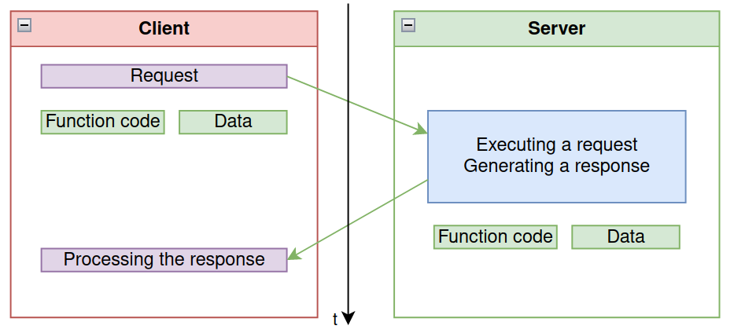
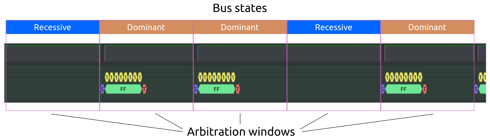
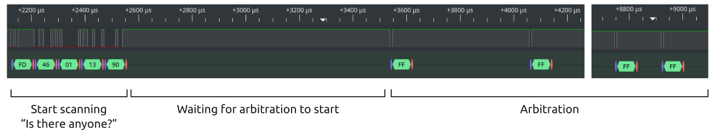
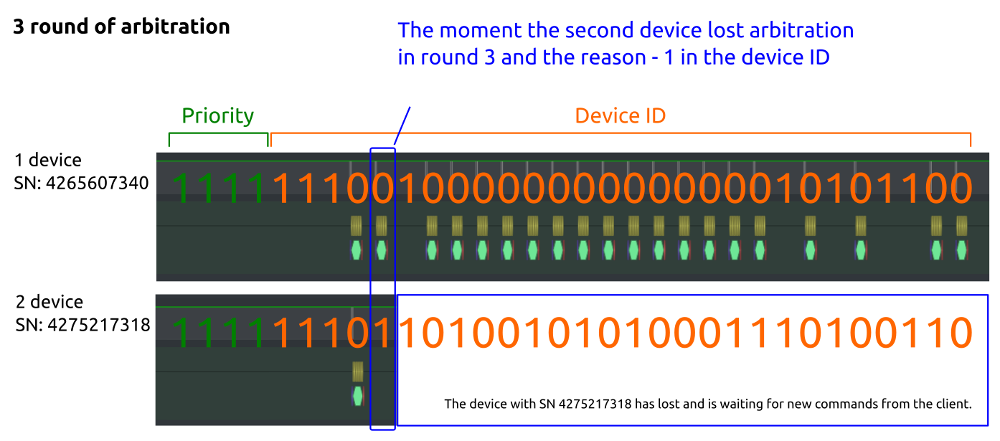
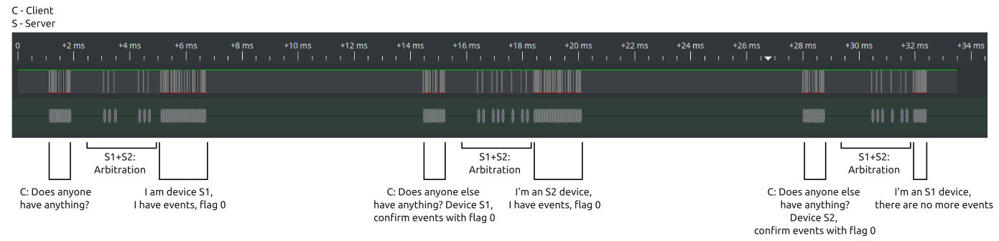

The following is a story about implementing fast bus scanning, event handling, and address collision resolution in Modbus. The article will help you discover why we needed these features, the challenges we faced, and the solutions we developed.

## Task

Wiren Board peripheral devices are connected to the RS-485 bus and operate using the Modbus RTU protocol, a legacy industrial communication standard that remains widely supported across controllers and top-level software systems.


A controller and some peripherals made by Wiren Board

However, Modbus RTU’s architecture introduces several challenges:

- **Address collisions:** when two devices share the same address, one must be physically disconnected to reassign the other to a free address.  
- **Slow bus scanning:** The system must scan all 247 addresses across every possible connection parameter, which is time-consuming.  
- **Inefficient register polling:** With many devices and hundreds of registers each, polling delays can stretch to several seconds, resulting in sluggish system performance.
    

The first two issues—address collisions and slow bus scanning—only arose during commissioning and didn’t impact end users. However, the long polling period directly affected system responsiveness. To address this, integrators had to fine-tune the system by increasing polling speeds, disabling unnecessary register polling, adjusting driver priorities, and splitting the bus into multiple segments.

But what requires fast responses in dispatch systems and building automation? Primarily, user actions. For instance, when a user flips a switch, the light should turn on instantly. The maximum delay between action and response is critical here—if the system typically responds in 10 ms but occasionally takes 10 seconds, users will notice and complain.

With these challenges clearly identified, we set out to solve them.

## Defining the Solution Requirements

Our initial thought was to switch the device interface and protocol, such as adopting CAN bus.

However, this approach didn’t work for us:

- Our expertise lies in Modbus RTU and RS-485 — our development and production processes are optimized for these technologies.  
- Many of our customers use Wiren Board devices with controllers that almost universally support Modbus RTU.  
- Third-party devices frequently connect to our controllers, and the availability of RS-485 and Modbus RTU devices far exceeds that of CAN bus devices.

We could have released two device lines with different protocols for separate market segments, but the costs for development, manufacturing, and support would have been prohibitively high.


An RS-485 transceiver integrated into the WB-MR6C v.2 device.

Therefore, preserving our core Modbus RTU protocol was essential. The only viable solution was to develop a protocol extension leveraging the capabilities built into Modbus by its creators.

Thus, the requirements for the solution were clear:

- **Software-only:** No hardware or circuitry changes — users of recently released devices should access the extension via a firmware update.
- **Compatibility with classic Modbus RTU:** Our devices must remain Modbus RTU-compliant and coexist on the same bus with other vendors’ Modbus devices and controllers that would be unaware of the extension.  
- **Simplicity:** It should be easy to implement in tandem with third-party top-level software, which was crucial for partners using our hardware with their software.  
- **Openness:** We would avoid closed protocols that lock users into a single hardware manufacturer.
    

## Hardware and Software for Experiments

In this article, we’ll explore the protocol extension through practical examples, supported by pictures captured in logic analyzer. If you’d like to see the inner workings firsthand, here’s a list of the devices and software used:

- **Linux computer with a converter:** Use the [WB-USB485](https://wirenboard.com/en/product/WB-USB485/) or another compatible converter, such as a Wiren Board controller. Additionally, install the [wb-modbus-scanner](https://github.com/wirenboard/wb-modbus-ext-scanner/) utility, which serves as a reference implementation of the master for the protocol extension. A precompiled version for Linux is available in the repository’s root directory.
    
- **Counter input module and relay:** Use the [WB-MCM8](https://wirenboard.com/en/product/WB-MCM8/) counter input module and the [WB-MR6C v.2](https://wirenboard.com/en/product/) relay. Ensure both modules are running the latest firmware with event support. If not, update the firmware using the method described in the documentation.
    
- **Logic analyzer:** A logic analyzer, such as an open-source Saleae clone, is required for capturing signal traces.
    
- **Software for analysis:** Use PulseView (for Linux) or Saleae Logic (for Windows). Enable the UART protocol decoder and set the sampling rate to 10M/2MHz. Commands were issued immediately after starting the capture to ensure the master’s request was recorded in full, as triggering on level decline would not capture the entire request.

We connected the logic analyzer to the RS-485 transceiver input of one of the slave devices on the bus.


_Experimental Setup Stand: laptop with Linux, WB-USB485 converter, logic analyzer, and two Wiren Board Modbus devices with support for Fast Modbus expansion._


_More photos of the setup_


_Connecting a logic analyzer to WB-MCM8_


_Scanning process looks like this_

## Classic Modbus RTU

Before diving into the protocol extension, let’s revisit how classic Modbus RTU works. For a comprehensive description, refer to the official Modbus documentation.

Modbus is a communication protocol designed for data exchange between industrial automation devices.

In Wiren Board devices, data is transmitted over RS-485 serial communication lines using the Modbus RTU protocol. Modbus RTU operates in half-duplex mode and follows a “client-server” or “master-slave” architecture:

- **Master:** The client, typically a controller or PLC.  
- **Slave:** The server, often an input/output module or peripheral device.

    
According to the protocol specification:
- Each slave on the bus has a unique address between 1 and 247.  
- Address 0 is reserved for broadcast commands.  
- Addresses 248 to 255 are reserved and unused in the protocol.  

The master periodically polls each slave in turn, and the slaves respond to these requests. Key characteristics of the protocol include:
- The master does not have an address.  
- Slaves cannot transmit messages without a request from the master.

If a command execution fails, the slave returns an error code. If a slave does not respond, the master waits for a predefined timeout before moving on to the next device.


_Modbus RTU protocol data packet contents_



_Modbus transaction sequence when completed without errors_

Data exchange in Modbus RTU occurs through registers, there are four types in total. Each type has its own read/write functions.

| **Type**               | **Size**        |  **Reading** | **Writing**       |
|------------------------|-----------------|-------------|-------------------------------|
| Coils - flag registers | 1 bit            | 0x01                      | 0x05 - one, 0x0F - many   |
| Discrete Inputs - discrete inputs | 1 bit | 0x02                  | —                             |
| Holding Registers - storage registers | 16-bit word | 0x03         | 0x06 - one, 0x10 - many   |
| Input Registers - input registers | 16-bit word | 0x04            | —           |                  |


**The master's request** contains the following information: address of the device on the bus; code of the function to be executed; the address of the first register, the number of registers needed and the checksum.

**The slave's response** contains the following information: device address; function code; number of bytes transferred; the data itself and the checksum (CRC).

#### Example of a Classic Modbus Request

Let’s request the Modbus address of a Wiren Board device (address 20), which is stored in holding register 128:

**Request:**
- `0x14` — Device address in HEX (20 in DEC).  
- `0x03` — Function code: read holding register.  
- `0x00 0x80` — Address of the first register in HEX (128 in DEC).  
- `0x00 0x01` — Request one register.  
- `0x87 0x27` — Checksum (CRC).

**Slave’s Response:**
- `0x14` — Device address in HEX (20 in DEC).  
- `0x03` — Function code executed.  
- `0x02` — Number of bytes transferred.  
- `0x00 0x14` — Data in the register (20 in DEC).  
- `0xB5 0x88` — Checksum (CRC).


_Example of a request for a Modbus address of a Wiren Board device and a response in classic Modbus RTU_

## Fast Modbus Extension

As we saw above, Modbus has a concept of functions. There are many functions, 15 of them are used, and the rest are reserved for hardware manufacturers. Therefore, manufacturers can add functionality missing from standard Modbus simply by using the capabilities inherent in the protocol.


_Functions described in the Modbus protocol specification_

We utilized the free function **`0x46`** to implement the capabilities of our extension. For broadcast commands, we use the reserved address **`0xFD`** (253 in DEC). The checksum is calculated in the same way as in standard Modbus RTU.

A key advantage of this approach is backward compatibility:
- If a PLC or SCADA system doesn’t recognize Fast Modbus, it will communicate with “fast” devices using standard read/write functions.  
- Similarly, Wiren Board controllers will poll slave devices that don’t support Fast Modbus in the traditional way.  

Fast Modbus is not a separate mode or a new protocol—it’s an extension of the standard Modbus RTU protocol. If the extended functions are available, they can be used; otherwise, the system operates as usual. Meaning that on the slave side, the extension requires adherence to timing requirements. The master, however, only needs to support the commands and packet format defined in the extension, without any additional modifications.

The **Fast Modbus** extension is open and fully [documented](https://github.com/wirenboard/wb-modbus-ext-scanner/blob/main/protocol.md). You’re free to use it in your devices and software. For device developers, we offer a **paid framework** that implements the classic Modbus RTU protocol with our extension and supports firmware updates over the RS-485 bus. However, this is optional—you can implement the extension independently.

Next, we’ll explore the benefits of this extension:  
- Instant device discovery on the bus.  
- Fast delivery of register changes from slave to master.  
- Resolution of address collisions on the bus.

## Arbitration

### Physics of the process

Arbitration is a mechanism that allows slaves to determine which device will respond to the master’s broadcast request and whether there are other devices competing to respond. This is typically achieved by having multiple devices evaluate the bus state during transmission.

We drew inspiration from CAN bus arbitration and adapted it for RS-485, considering the unique characteristics of the bus. While both RS-485 and CAN use transceivers (transmitters) to communicate over the bus, their designs differ significantly.

#### CAN Bus Arbitration

In CAN, two lines (CANH and CANL) are controlled by transistors:
- **Recessive State:** Both transistors are closed, and the lines are equalized through termination resistors.  
- **Dominant State:** Both transistors open, pulling CANH to power and CANL to GND. Receivers detect this state based on the potential difference.


_Transmission of different states by two transmitters in CAN. Resistors are line resistance_

If two CAN transmitters transmit different states simultaneously, the dominant state prevails. The transmitter sending the recessive state detects this and stops transmitting. It turns out that we can simultaneously set different states on the bus using different transmitters.

Arbitration in CAN occurs bit by bit, with the dominant state winning over the device that sets the recessive state.

**RS-485** also has two lines (A and B), but the transmitter has a separate pair of transistors to pull lines A and B to power (Q1 and Q2) and a separate pair to push to GND (Q3 and Q4) - this is necessary in order to be able to explicitly transmit logical zero and one to the line, which increases noise immunity.

- **Logical One:** Q1 pulls B to power, and Q4 presses A to GND.  
- **Logical Zero:** Q2 pulls A to power, and Q3 presses B to GND.  

When nothing happens on the bus at all, that isWhen no transmission occurs, the lines are pulled to a logical one by failsafe bias resistors.

At the moment of transmission, the transmitter is turned on and the transistors pull one of the lines to the power supply, and the other is pressed to GND - the states of the transistors depend on what we are transmitting:

If you follow andworking on the CAN bus, a natural way to listen to the echo during transmission suggests itself in the hope that one of the states on the RS-485 line will be dominant - but this will not happen.


_Simultaneous transmission of logical 0 and 1 by RS-485 transmitters. Receivers are not indicated on the diagram_

The picture above, shows two transmitters connected to a common RS-485 bus and transmit different states simultaneously:

- The first transmitter has its transistors Q1a and Q4a open - a logical one is transmitted to the bus;
- The second transmitter has its transistors Q2b and Q3b open - a logical zero is transmitted to the bus.
    

As you can see, when transmitters transmit different states simultaneously, current flows between them. On short lines, the stronger transmitter dominates; on long lines, the potential distributes unevenly. This makes it impossible to use logical 0 and 1 as dominant and recessive states. Therefore, we had no other choice but to accept silence as a recessive state, and the transmission of one of the states as dominant.

#### Our Solution

We adopted **silence** as the recessive state and **transmission of a specific state** as the dominant state. However, we faced a challenge: Linux on the master side detects errors if received packets don’t conform to the USART frame format. To address this, we made the dominant state the transmission of one byte (`0xFF`), which simplifies processing on Linux and eliminates the need for slaves to monitor the bus during arbitration.


_Waveform of arbitration on the RS-485 bus_

Dominant state is transmitted as `0xFF` using standard USART transmission and hardware-controlled bus drivers. `0xFF` represents the maximum value for a single byte and is sent as a 1-bit pulse during the start bit. For the rest of the transmission, the bus remains in state 1 (IDLE). This approach minimizes desynchronization between slave transmitters.

**Recessive state** is silence during the arbitration window, meaning the transmitter is disabled. This avoids the RS-485 hardware limitation where simultaneous transmission of different states is impossible.

**Arbitration window** is the time needed to receive 12 bits (one UART frame with two stop bits and a parity bit) plus a 50 µs buffer for interrupt processing in the slave microcontroller. This buffer is a multiple of the bit transmission time.


_Logic analyzer picture of recessive and dominant states on the bus at the time of arbitration_

Each arbitration window transmits one identifier bit 0 for a dominant state, and 1 as a recessive state.

If the device must transmit a **dominant state**, it sends `0xFF` at the start of the arbitration window. If another transmission is already in progress, the device remains silent to avoid sending an out-of-sync message. Such a device cannot lose in this arbitration window. Alien transmissions are detected using the **BUS BUSY** flag in the USART hardware, which is set if an alien start bit is detected on the bus.

If the device must transmit a **recessive state**, it remains silent throughout the arbitration window and listens to the bus. If a byte is received during this window, another device has transmitted a dominant state, and arbitration is lost.

- **0 (Dominant):** The device sends `0xFF` at the start of the window. If another transmission is detected (via the BUS BUSY flag), the device remains silent.  
- **1 (Recessive):** The device remains silent and listens. If a byte is received, another device has transmitted a dominant state, and arbitration is lost.

### Arbitration Flow

During arbitration, the slave device transmits an **arbitration word** bit by bit. This word consists of a **priority** and a **unique identifier**.

- **Message Priority:** 4 bits, where `0` (`0b0000`) is the highest priority and `15` (`0b1111`) is the lowest.  
- **Unique Identifier:** Depends on the command sent by the master:  
- **Scan:** A 28-bit number derived from the lower 28 bits of the device’s unique serial number. This allows us to ignore Modbus address collisions and ensures compatibility with devices from other manufacturers. For DIY projects, a separate range of serial numbers is allocated, as documented on GitHub.  
- **Event Polling:** An 8-bit Modbus address. Since devices are already configured and address collisions are resolved, there’s no need to use serial numbers for arbitration.  

The arbitration word is **12 bits long** (4 + 8) for events or **32 bits long** (4 + 28) for scanning. Bits are transmitted starting with the **MSB** (Most Significant Bit) and ending with the **LSB** (Least Significant Bit).

Each bit of the arbitration word is transmitted during a single arbitration window. By the end of the arbitration process, only one device remains—the winner.

- **0 (Dominant State):** Transmitted by sending `0xFF`.  
- **1 (Recessive State):** Transmitted by remaining silent.  

This means arbitration is always won by the device with the **lowest arbitration word value**. Higher-priority messages (lower priority bits) win first. If priorities are equal, the device with the **lowest unique identifier** wins.

#### Why Only 28 Bits of the Serial Number Are Used for Scanning

The serial number of our devices is a 32-bit number. However, we only use the **lower 28 bits** for scanning. The **most significant 4 bits** are discarded to fit the arbitration word into 32 bits (28 + 4). Since these 4 bits are always `1` in our serial numbers, discarding them doesn’t affect uniqueness.


_When scanning, the lower 28 bits of the serial number are used device numbers. The highest four are discarded. We specially issue serial numbers so that this does not affect uniqueness._


_An example of how arbitration occurs when scanning a bus_

### Timings

To understand the timings, let’s revisit the structure of a UART frame. Each bit, including start and stop bits, has a duration of `1 / baudrate`. We use a hardware timer synchronized with the UART bit rate to define arbitration windows, ensuring all intervals are multiples of the bit transmission time.

#### Key Timing Parameters

- **Wait for Arbitration Start:** The time between the master’s request and the first arbitration window.  
- **Upper Limit:** The transmission time of 3.5 characters (Modbus standard), allowing the master to switch from transmitter to receiver mode.  
- **Lower Limit:** 800 µs, experimentally determined with a safety margin, ensuring devices have time to process the request and decide whether to participate in arbitration.  
- **Arbitration Window Duration:** The time required to transmit one 12-bit UART frame (8 data bits, 1 parity bit, 2 stop bits, and 1 start bit) plus 50 µs for processing. This is rounded up to a whole bit duration.  
- **Timeout for Receiving Response:** The time the master waits to determine if no devices support Fast Modbus, after which it falls back to classic polling.  
- **Calculation:** `Wait for arbitration start + (Arbitration window duration * Number of bits in arbitration)`.


_Creating a timeout for receiving a response_

#### Example: Timeout Calculation at 115200 bps

- **Bit Duration:** `(1s / 115200 bps) * 1000000 = 8.681 µs`  
- **Wait for Arbitration Start:**  
  - `3.5 * (1 start + 8 data + 1 parity + 2 stop) = 42 bits * 8.681 µs = 364.602 µs`  
  - Since this is less than 800 µs, we round up: `ROUNDUP(800 / 8.681) = 93 bits` → `93 * 8.681 = 807.333 µs`  
- **Arbitration Window Duration:**  
  - `(12 bits * 8.681 µs) + ROUNDUP(50 µs / 8.681 µs) * 8.681 µs = 104.172 + 68.681 = 156.258 µs`  
- **Timeout for Response:**  
  - **Scan (32 bits):** `807.333 µs + 156.258 µs * 32 = 5800.256 µs ≈ 5.8 ms`  
  - **Events (12 bits):** `807.333 µs + 156.258 µs * 12 = 2675.096 µs ≈ 2.7 ms`

## Scan

### Principle

Classic Modbus bus scanning involves sequentially checking all addresses and connection settings, which can take over 15 minutes: 247 addresses, 8 baud rates, 3 parity options, and 2 stop bit configurations. If devices share the same address, distinguishing between them becomes impossible.

With Fast Modbus, scanning all combinations of speed, parity, and stop bits on a single bus takes just ~3.5 seconds. We avoid iterating through all 247 addresses and waiting for timeouts, significantly saving time.

Here’s how it generally works in our devices:

1. The master sends a **“Start scanning”** broadcast command to the bus.
2. Slaves conduct arbitration—the winner transmits its serial number and Modbus address.
3. The master accesses the winning slave by serial number and reads its model.
4. The master sends a **“Continue scanning”** command.
5. Slaves conduct arbitration again, and the winner sends its data. The master reads the model.
6. This cycle repeats until no unscanned devices remain. When no devices respond, the master receives an **“End of scan”** message.


_In practice, the process involves: “Who is there?” requests, arbitration, responses from winners (“I’m here!”), and the final “No one else.”_

If no devices respond to the **“Start scanning”** command, the master waits for a short timeout and switches communication settings. Since the timeout is minimal and addresses aren’t iterated, scanning through settings is extremely fast.

#### Functions for Scanning
- `0x01`: Start scanning (sent by the master).  
- `0x03`: Scan response (sent by a slave).  
- `0x02`: Continue scanning (sent by the master).  
- `0x04`: End of scan (sent by a slave).  

#### Block Diagram


Let’s connect two devices to the bus:
1. **WB-MCM8:** Serial number `4265607340` (`0xFE4000AC`).  
2. **WB-MR6C v.2:** Serial number `4275217318` (`0xFED2A3A6`).  

We’ll scan the bus using the `wb-modbus-scanner` utility:

```
# wb-modbus-scanner -d /dev/ttyRS485-1 -D -b 115200
Serial port: /dev/ttyRS485-1
Use baud 115200
send SCAN INIT -> : FD 46 01 13 90
<- : FF FF FF FF FF FF FF FF FF FF FF FF FF FF FF FF FF FF FF FF FF FF FD 46 03 FE 40 00 AC 14 E8 3A
read DEVICE MODEL
-> : FD 46 08 FE 40 00 AC 03 00 C8 00 14 91 BA
<- : FD 46 09 FE 40 00 AC 03 28 00 57 00 42 00 4D 00 43 00 4D 00 38 00 00 00 00 00 00 00 00 00 00 00 00 00 00 00 00 00 00 00 00 00 00 00 00 00 00 00 00 C5 25
Found device ( 1) with serial 4265607340 [FE4000AC] modbus id: 20 model: WBMCM8
send SCAN NEXT -> : FD 46 02 53 91
<- : FF FF FF FF FF FF FF FF FF FF FF FF FF FF FF FD 60 03 FE D2 A3 A6 F1 B4 49
read DEVICE MODEL
-> : FD 46 08 FE D2 A3 A6 03 00 C8 00 14 8A AF
<- : FD 46 09 FE D2 A3 A6 03 28 00 57 00 42 00 4D 00 52 00 36 00 43 00 00 00 00 00 00 00 00 00 00 00 00 00 00 00 00 00 00 00 00 0 0 00 00 00 00 00 00 00 CE 86
Found device ( 2) with serial 4275217318 [FED2A3A6] modbus id: 241 model: WBMR6C
send SCAN NEXT -> : FD 46 02 53 91
<- : FF FF FF FF FF FF FF FF FF FF FF FF FF FF FF FF FF FF FF FF FD 46 04 D3 93
End SCAN

```

While executing the command, we enabled debugging with the -D parameter to see the bytes being sent and received. The process will be shown below.

### Start Scanning

The master sends the **“Start scanning”** command to the bus, effectively asking, “Who is there?” Upon receiving this command, all slave devices on the bus mark themselves as unscanned.

Unscanned devices respond with the same priority (`0b0110`), so the device with the **lowest serial number** wins the arbitration.

#### "Start Scan" command

```
FD 46 01 13 90
```

- `0xFD`: Broadcast address.  
- `0x46`: Command for extended functions.  
- `0x01`: Subcommand to start scanning.  
- `0x13 0x90`: Checksum.


Start scanning and arbitration

### Response from the Arbitration Winner

The slaves conduct arbitration, and the unscanned device with the **lowest serial number** wins. The winning device responds with its serial number and Modbus address, allowing the master to detect and resolve address collisions by addressing devices via their serial numbers.

, so the second one loses by serial number")
The priority of both devices is the same (0110), so the second loses by serial number


_Request, arbitration and winner's response_


#### Device response with information about itself
```
FD 46 03 FE 40 00 AC 14 E8 3A
```

- `0xFD` — broadcast address;
- `0x46` — command for working with extended functions;
- `0x03` — scan response subcommand;
- `0xFE` 0x40 0x00 0xAC — device serial number (big endian);
- `0x14` — modbus address of the device;
- `0xE8` 0x3A — checksum.

### Read Registers according to Serial Number

After the master receives a response from the slave that won the arbitration, it can send an additional request, such as retrieving the device model.

In this process, we access the device by its serial number, use the standard “read register” command, and package the request in a special packet that emulates the standard `0x08` command.

```
FD 46 08 FE 40 00 AC 03 00 C8 00 14 91 BA
```

- `0xFD` — broadcast address;
- `0x46` — command for working with extended functions;
- `0x08` — subcommand for emulating standard requests;
- `0xFE 0x40 0x00 0xAC` — serial number of the device we are accessing (big endian);
- `0x03` — normal request: standard function code for working with registers;
- `0x00 0xC8 0x00 0x14` — request body: read 20 registers (0x14) starting from 200 (0xC8);
- `0x91 0xBA` - checksum.


_Request for registers with device model and response_

The device receiving a request addressed to it responds with a packet using the `0x09` function, enclosing a standard Modbus command response in the body.

Response to a register read request
```
FD 46 09 FE D2 A3 A6 03 28 00 57 00 42 00 4D 00 52 00 36 00 43 00 00 00 00 00 00 00 00 00 00 00 00 00 00 00 00 00 00 00 00 00 00 00 00 00 00 00 00 CE 86
```

- `0xFD` — broadcast address;
- `0x46` — command for working with extended functions;
- `0x09` — subcommand for emulating a response to a standard request;
- `0xFE 0x40 0x00 0xAC` — serial number of the device we are accessing (big endian);
- `0x03` — normal answer: standard function code for working with registers;
- `0x28 0x00 0x57 0x00 0x42 0x00 0x4D 0x00 0x43 0x00 0x4D 0x00 0x38 0x00 0x00 0x00 0x00 0x00 0x00 0x00 0x00 0x00 0x00 0x00 0x00 0x00 0x00 0x00 0x00 0x00 0x00 0x00 0x00 0x00 0x00 0x00 0x00 0x00 0x00 0x00 0x00` — response body;
- `0xCE 0x86` - checksum.


_Entire master request and slave response_

### Continue scanning

The master receives a response from the device that won the arbitration and reads additional information from it. Then, it sends the “Continue scanning” command, essentially asking, “Is there anyone else?”.

"Continue scanning" command

```
FD 46 02 53 91
```

- `0xFD` — broadcast address;
- `0x46` — command for working with extended functions;
- `0x03` — scan response subcommand;
- `0xFE 0x40 0x00 0xAC` — device serial number (big endian);
- `0x14` — modbus address of the device;
- `0xE8` 0x3A — checksum.

The devices enter arbitration again, with the unscanned device having the lowest serial number winning. The arbitration winner responds with “I’m here,” and the master retrieves its model information.


_The arbitration was won by the device with higher priority_

This cycle of “Continue Scan” → “Arbitration” → “Device Response” → “Model Request” → “Device Response” repeats until all devices on the bus have been scanned.


Continuation of scanning, arbitration and response of another unscanned device

### End scan

An important detail is that with each “Continue scanning” request from the master, all devices on the bus participate in arbitration. However, messages from unscanned devices have a higher priority (0b0110), while those from scanned devices have a lower priority (0b1111). As a result, as long as there are unscanned devices remaining, they will always win arbitration due to their higher priority.

Once all devices on the bus have been scanned, the next “Continue scanning” command will result in a scanned device winning arbitration. This will be the device with the lowest serial number, based on the remaining bits of the arbitration word. However, which specific scanned device wins does not matter, as all of them attempt to send the same “End Scan” message.

Upon receiving this response, the master can confidently conclude that no unscanned devices remain on the bus, eliminating the need for a timeout.


_Only scanned devices remained, so messages from one of them won arbitration. The second device was lost by serial number_

"End of scan" message

```
<- FD 46 04 D3 93
```

- `0xFD` — broadcast address;
- `0x46` — command for working with extended functions;
- `0x04` — subcommand to end scanning;
- `0xD3 0x93` — checksum.


_Continuation of scanning, arbitration and the winner's answer - “There is no one else”_

## Events

### Overview

The Fast Modbus extension enables quick polling of events from devices without sequentially querying each one. Unlike scanning, this process uses Modbus addresses, so address collisions must be avoided, just as in classic Modbus.

Here’s how it works:

1. The master sends a broadcast command: **“Does anyone have events?”**  
2. Slaves conduct arbitration based on priority and address—the winner transmits its events.  
3. The master receives the event packet and sends another **“Does anyone have events?”** command.  
4. If no events remain, the device with the lowest Modbus address wins arbitration and informs the master that no more events are available.  
5. The cycle repeats: arbitration, event response, and acknowledgment.


_Block diagram of event polling_

#### Functions for Event Handling

- `0x10`: Master requests events from slaves.  
- `0x11`: Slave transmits events to the master.  
- `0x12`: Slave responds if no events are available.  
- `0x18`: Master configures events in the slave.  

#### Event Types

There are 4 types of events, corresponding to register types, and a fifth system event:
- `1`: Coil.  
- `2`: Discrete.  
- `3`: Holding.  
- `4`: Input.  
- `15`: System event. 
    

By default, all events in Wiren Board devices are disabled except the low-priority **“I rebooted”** event. Events are enabled by adjusting their priorities, which affect the 4-bit message priority during arbitration:
- `0`: Event is inactive.  
- `1`: Low-priority event.  
- `2`: High-priority event.
    

**Priorities are set per event:** If a device has a high-priority event, it enters arbitration with a lower priority bit value, increasing its chances of winning. If multiple devices have high-priority events, they win arbitration in order of their Modbus addresses (lowest first). For more details, see the **Arbitration** section.

The master can also request events starting from a specific Modbus address. This prevents devices with low addresses from monopolizing the bus with frequent events.


_Event Request and Response Process_

### Event Acknowledgment

To ensure reliable event delivery, the Fast Modbus extension includes an acknowledgment mechanism. Each event packet contains a **flag field** (0 or 1). Slaves invert this flag in each subsequent packet they send, ensuring no two consecutive packets from the same device have the same flag. Flags are independent between devices.

When the master receives an event packet, it sends another broadcast event request, including the Modbus address of the device to acknowledge and the flag from the received packet. If no acknowledgment is needed, the master sets the device address field to 0.

The slave, upon seeing its address and the correct flag in the event request, clears the sent events and prepares new ones for arbitration. If the flag is incorrect, the slave adds new events to the existing ones and retransmits them with the same flag.

During event polling, the master uses a standard wait time formula, expecting 12 arbitration windows: 4 for priority bits and 8 for Modbus address bits.


_Event acknowledgment and flag rotation_

### Setting up events on the device

To enable event sending for changes to the short press counter of the eighth input on the WB-MCM8 device with address 20, follow these steps.

```
# wb-modbus-scanner -d /dev/ttyRS485-1 -D -i 20 -r471 -t 4 -c 1 -b 115200
Serial port: /dev/ttyRS485-1
Use baud 115200
    -> : 14 46 18 05 04 01 D7 01 01 69 EA
    <- : 14 46 18 01 01 41 1C

```

Command parameters:

- `-d`: Enable debugging (output raw bytes).
- `-b` 115200: Set bus speed to 115200 bps.
- `-i 20`: Modbus address of the device.
- `-r471`: Device register – 471.
- `-t 4`: Register type (Input).
- `-c 1`: Enable event with priority 1.

If the device is rebooted, the event will be disabled and must be re-enabled. In the Wiren Board controller, the wb-mqtt-serial driver automatically enables necessary events upon receiving the “I rebooted” event from the device.

When configuring events, note that not all registers in Wiren Board devices support events. This prevents spam from unimportant events, such as supply voltage changes. The registers that support events are documented for each device. The Wiren Board controller’s driver uses device templates to enable the appropriate events, so no manual configuration is required.

When developing custom devices using the Fast Modbus extension, you can implement your own behavior, such as saving event settings across reboots or averaging values to avoid spam. The protocol imposes no restrictions.

The master would receive a command: “Device with address 20, enable an event for register 471 with priority 1.”

Event Setup Command
```
14 46 18 05 04 01 D7 01 01 69 EA
```

- `0x14` — device address (20);
- `0x46` — command for enabling event transmission;
- `0x18` — subcommand for event configuration;
- `0x05` — length of the settings list (5 bytes);
- `0x04` — register type (Input);
- `0x01 0xD7 0x01` — register address (471 in big-endian);
- `0x01` — number of consecutive registers;
- `0x01` — event priority;
- `0x69 0xEA` — checksum.

Multiple registers can be configured in a single request by extending the settings list. The command would send this: “Device with address N, enable events in X registers, starting with register Y, and set such and such priorities for each.”

The device’s response to the command to change event would send the following information: “I am a device with address 20, I have enabled events with such and such priorities.”

Device response to event configuration command

```
14 46 18 01 01 41 1C
```

- `0x14` — device address (20);
- `0x46` — command for enabling event transmission;
- `0x18` — subcommand for event configuration;
- `0x01` — length of the settings list;
- `0x01` — event enable flags (1 register enabled);
- `0x41 0x1C` — checksum.

The response omits the register type, address, and count fields, packing the enable the permission flags (priorities) into bit masks.


_Event setup command and slave response_


In a similar way, let’s enable an event for the state of the first output of the WB-MR6C v.2 relay (address 241, register 0, type Coil, priority 2):

```
# wb-modbus-scanner -d /dev/ttyRS485-1 -D -i 241 -r0 -t 1 -c 2 -b 115200
Serial port: /dev/ttyRS485-1
Use baud 115200
-> : F1 46 18 05 01 00 00 01 02 A2 BB
<- : F1 46 18 01 01 0C CA

```

Command Parameters:

- `-D` — enable debugging;
- `-b 115200` — bus speed;
- `-i 241` — Modbus address of the device;
- `-r0` — register 0;
- `-t 1` — register type (Coil);
- `-c 2` — enable event with priority 2.

As the structure of event configuration packages was discussed above; we will not return to it here.

After configuration, we generate events:
- Toggle the 8th input of WB-MCM8 to increment the input counter.
- Activate channel 1 of the WB-MR6C v.2 relay by closing its input 1.

Wiren Board devices currently lack an event queue. Instead, they report the event and the current register state (payload). For fast changes, such as switch presses, counters are used.

### Event Request and Device Responses

With two devices on the bus, three requests and arbitration rounds are needed to retrieve all events and confirm their absence. In practice, the master continuously sends requests, and devices arbitrate to send events or confirm their absence.

But in order to understand the essence of what is happening, we will roughly divide the series of requests and responses into rounds.

#### Round 1

Let's use our utility and request events from devices without confirmation (-e 0):

```
# wb-modbus-scanner -d /dev/ttyRS485-1 -D -e 0 -b 11520
Serial port: /dev/ttyRS485-1
Use baud 115200
send EVENT GET -> : FD 46 10 00 FF 00 00 C8 9A
<- : FF FF FF FF FF FF F1 46 11 00 02 09 01 01 00 00 01 00 0F 00 00 10 64
device: 241 - events: 2 flag: 0 event data len: 009 frame len: 017
Event type: 1 id: 0 [0000] payload: 1 device 241
Event type: 15 id: 0 [0000] payload: 0 device 241
```

Command parameters:

- `-D` — enable debugging;
- `-b 115200` — bus speed;
- `-e 0` — confirm events with flag `0` (no confirmation needed).  
  To confirm events with flag `1`, use `-E`. This parameter is followed by the address of the device that needs to confirm events.  
  Since there was no such device in this example, `0` was specified.
    

Breaking it down, byte by byte:
```
FD 46 10 00 FF 00 00 C8 9A
```

- `0xFD` — broadcast address;
- `0x46` — command for extended functions;
- `0x10` — subcommand for event requests;
- `0x00` — minimum Modbus address for arbitration;
- `0xFF` — maximum event data length (256 bytes);
- `0x00` — address of the device from which the previous event packet was received.  
  Needed to confirm delivery; since we have nothing to confirm, it's set to zero;
- `0x00` — flag to confirm previously received packets (none);
- `0xC8 0x9A` — checksum.

After the master requests events, the devices arbitrate, considering the priority bits.

**In the first round**, arbitration was won by the WB-MR6C relay with address 241, while WB-MCM8 with address 20 lost. This occurred because we had configured a high-priority event for the relay, and it was triggered before the master’s event request. In other words, the relay won arbitration due to priority bits, not its serial number.


_The device with the priority event won the first round of arbitration_

#### Device Response (Round 1)

This is a response from device with address 241, byte by byte:
```
F1 46 11 00 02 09 01 01 00 00 01 00 0F 00 00 10 64
```

- `0xF1` — device address (241);
- `0x46` — command for extended functions;
- `0x11` — subcommand for transmitting events;
- `0x00` — flag for acknowledgment;
- `0x02` — number of events;
- `0x09` — length of event data up to the checksum;
- **Event 1:** `0x01 0x01 0x00 0x00 0x01`;
- **Event 2:** `0x00 0x0F 0x00 0x00`;
- `0x10 0x64` — checksum.

This response includes all unacknowledged events from the device.

The first event indicates that the state of the relay’s first output (register 0) has changed to `1` (on). 

- `0x01` — length of additional event data (payload);
- `0x01` — event type (Coil);
- `0x00 0x00` — event identifier or register number (big-endian);
- `0x01` — payload (little-endian).

The second event is a system event indicating the device has rebooted. As we did not confirm the event it came along with the event that we generated ourselves - “output 1 is turned on”.

- `0x00` — length of additional event data;
- `0x0F` — event type (System event, “I rebooted”);
- `0x00 0x00` — event identifier or register number (big-endian);
- no additional data.

#### Round 2

After processing the response, the master sends another event request, this time confirming the events with flag 0 from device 241 (`-e 241`):

```
# wb-modbus-scanner -d /dev/ttyRS485-1 -D -e 241 -b 115200
Serial port: /dev/ttyRS485-1
Use baud 115200
send EVENT GET -> : FD 46 10 00 FF F1 00 8D 0A
<- : FF FF FF FF FF FF FF FF 14 46 11 00 02 0A 02 04 01 D7 01 00 00 0F 00 00 7A DA
device: 20 - events: 2 flag: 0 event data len: 010 frame len: 018
Event type: 4 id: 471 [01D7] payload: 1 device 20
Event type: 15 id: 0 [0000] payload: 0 device 20
```

Event request with confirmation, byte by byte:
```
FD 46 10 00 FF F1 00 8D 0A
```

- `0xFD` — broadcast address;
- `0x46` — command for extended functions;
- `0x10` — subcommand for event requests;
- `0x00` — minimum Modbus address for arbitration;
- `0xFF` — maximum event data length (256 bytes);
- `0xF1` — device address for confirmation (241);
- `0x00` — flag for confirmation;
- `0x8D 0x0A` — checksum.

The device with address 241 silently confirms the sent events and will use flag 1 in its next event packet. It also participates in arbitration with other devices, sending a “no events” message with the lowest priority (0b1111).

**In the second round**, the WB-MCM8 device (address 20) wins arbitration due to its event priority.


_The second round of arbitration is won by the device with a regular event due to the fact that no one has any more events_

Response from device with address 20, byte by byte:

```
14 46 11 00 02 0A 02 04 01 D7 01 00 00 0F 00 00 7A DA
```

- `0x14` — device address (20);
- `0x46` — command for extended functions;
- `0x11` — subcommand for transmitting events;
- `0x00` — flag for acknowledgment;
- `0x02` — number of events;
- `0x0A` — length of event data;
- **Event 1:** `0x02 0x04 0x01 0xD7 0x01 0x00`;
- **Event 2:** `0x00 0x0F 0x00 0x00`;
- `0x7A 0xDA` — checksum.

This response includes all events from the device which are not confirmed by the master.

The first event indicates that the counter for input 8 (register 471) has incremented to 1 _0x02 0x04 0x01 0xD7 0x01 0x00_:

- `0x02` — length of additional event data (payload);
- `0x04` — event type (`4` = Input);
- `0x01 0xD7` — event identifier or register number (`471` in big-endian);
- `0x01 0x00` — additional data (payload) (little-endian), i.e., contents of input register `471`.
    
The second event is a system event indicating the device has rebooted containing  _0x00 0x0F 0x00 0x00_:

- `0x00` — length of additional event data;
- `0x0F` — event type (System event `15`, “I rebooted”);
- `0x00 0x00` — event identifier or register number (big-endian);
- no additional data.

The "I rebooted" event occurred immediately after power was enabled and the master did not confirm it - so it came along with the event that we generated ourselves - input counter 1 changed.

#### Round 3

After processing the response, the master sends another event request, this time confirming the events from device 20 (-e 20) with flag 0:

```
# wb-modbus-scanner -d /dev/ttyRS485-1 -D -e 20 -b 115200
Serial port: /dev/ttyRS485-1
Use baud 115200
send EVENT GET -> : FD 46 10 00 FF 14 00 C7 9A
<- : FF FF FF FF FF FF FD 46 12 52 5D
NO EVENTS
```

Master request with confirmation explained:
```
FD 46 10 00 FF 14 00 C7 9A
```

- `0xFD` — broadcast address;
- `0x46` — command for extended functions;
- `0x10` — subcommand for event requests;
- `0x00` — minimum Modbus address for arbitration;
- `0xFF` — maximum event data length (256 bytes);
- `0x14` — device address for confirmation (20);
- `0x00` — flag for confirmation;
- `0xC7 0x9A` — checksum.

The device with address 20 silently confirms the sent events and will use flag 1 in its next event packet. It also participates in arbitration with other devices, sending a “no events” message with the lowest priority (0b1111).


_The third round of arbitration is won by the device with the lowest serial number since the message priorities are the same_

The response of the device with address 20 is “There are no more events”. Byte by byte:
```
FD 46 12 52 5D
```

- `0xFD` — broadcast address;
- `0x46` — command for extended functions;
- `0x12` — subcommand for no events;
- `0x52 0x5D` — checksum.

After receiving the “no events” message, the master continues polling for new events, without confirmations. The wb-mqtt-serial driver sends event requests at a fixed interval depending on the serial port speed:
- 50 ms at 115200 baud and above
- 100 ms at 38400–115199 baud
- 200 ms at lower speeds

This ensures timely event delivery without overloading the bus.

## Resolving address collisions on the bus

In addition to scanning the bus and working with events, the Fast Modbus extension allows you to access a device by its serial number and write values to its registers. This feature can resolve Modbus address collisions on the bus—simply assign a free Modbus address to one of the devices with conflicting addresses.

```
# wb-modbus-scanner -d /dev/ttyRS485-1 -D -b 115200 -s 4265607340 -i 200
Serial port: /dev/ttyRS485-1
Use baud 115200
Chande ID for device with serial 4265607340 [FE4000AC] New ID: 200
-> : FD 46 08 FE 40 00 AC 06 00 80 00 C8 DC 35
<- : FD 46 09 FE 40 00 AC 06 00 80 00 C8 8D F0
```

Command for changing modbus address according to serial number and device response, explained:
```
FD 46 08 FE 40 00 AC 06 00 80 00 C8 DC 35
```

- `0xFD` — broadcast address;
- `0x46` — command for working with extended functions;
- `0x08` — subcommand for emulating standard requests;
- `0xFE 0x40 0x00 0xAC` — serial number of the device (big-endian);
- `0x06` — standard function code for writing registers;
- `0x00 0x80 0x00 0xC8` — request body: write the number `200` (`0x00 0xC8`) to register `128` (`0x00 0x80`);
- `0xDC 0x35` — checksum.

```
FD 46 09 FE 40 00 AC 06 00 80 00 C8 8D F0
```

- `0xFD` — broadcast address;
- `0x46` — command for working with extended functions;
- `0x09` — subcommand for emulating a response to a standard request;
- `0xFE 0x40 0x00 0xAC` — serial number of the device (big-endian);
- `0x06` — standard function code for writing registers;
- `0x00 0x80 0x00 0xC8` — response body: wrote the number `200` to register `128`;
- `0x8D 0xF0` — checksum.

Thus, using the 0x08 standard request emulation function, we can read and write any device registers by addressing them via their serial number.


_Example of changing the modbus address by serial number_

## Simultaneous operation of devices with Fast Modbus and classic Modbus RTU

Since the extension is based on classic Modbus, and arbitration between devices occurs only after a request from the master, the master can work on the same bus with both “fast” and “slow” devices.

The master alternates between classic Modbus requests and Fast Modbus broadcast requests. Devices that do not support the extension simply ignore the unfamiliar broadcast address and commands.

To illustrate, we started polling devices through our wb-mqtt-serial driver, which can simultaneously poll devices using regular polling and event-based polling. The driver sends periodic event requests (50–200 ms depending on baud rate), reads the responses, and spends the rest of the time working with devices using normal polling. If the driver receives an “I rebooted” event from a device, it sends a packet with event settings to the device.


_Work on the same device bus without and with support for Fast Modbus_

## What's next

The next step is to integrate all extension capabilities into the controller software, including:
- Automatically adding devices on the bus to the driver configuration.
- Setting optimal communication settings.
- Distributing addresses to resolve collisions.

We are also considering expanding the capabilities of peripheral devices, such as enabling them to exchange messages with each other without a controller. This would allow building truly distributed automation systems on top of the classic and reliable RS-485 bus.

Additionally, we will assist partners in implementing this extension into their devices and open-source top-level software.

## Conclusion

In this article, we discussed our Fast Modbus extension, the reasons for its creation, its basic principles, and the problems it solves.

With this extension, our devices can now:
- Be instantly discovered on the bus.
- Resolve Modbus address collisions.
- Eliminate delays in transmitting register changes in installations with many devices.

We achieved a good distribution of reaction times to events. Below is an example of our histogram. We connected multiple relays to one controller on a single bus, triggered the relay inputs via GPIO, and measured the delay from sending a pulse to receiving an update in MQTT. The results were tabulated and used to construct a histogram.


_Histogram showing the reaction time distribution in Fast Modbus_

The extension is implemented at the software level using capabilities inherent in the original protocol, ensuring full compatibility with the Modbus standard. If the master does not recognize the extension, it will interact with devices using classic Modbus.

Fast Modbus is an open and well-documented extension of the Modbus RTU protocol, so you are free to use it in your devices and software.
